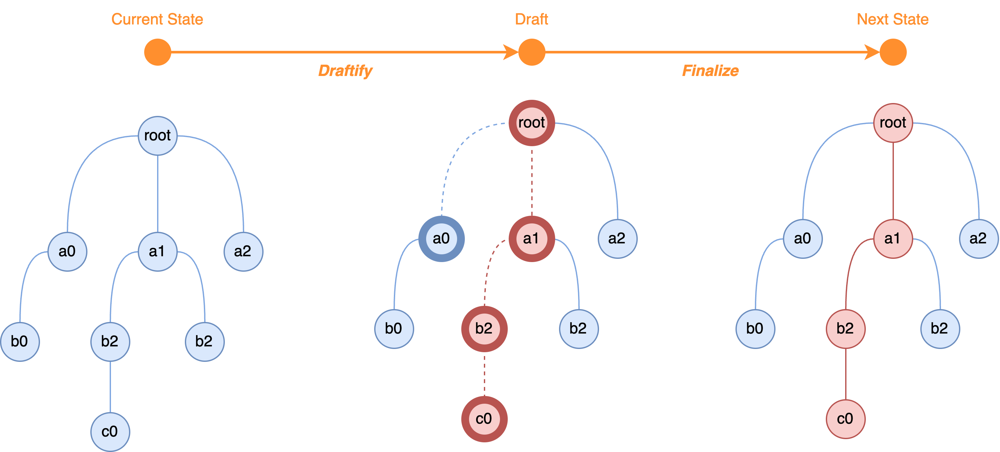

# Concepts

Mutative is based on the Proxy, its core concepts are `draft` and `patch`.

## Base Workflow

Mutative Workflow depicted in the image illustrates a three-stage process:



- The "Current State" represents the initial, unchanged state. 
- The "Draft" stage indicates a mutable phase where changes are made to a draft, marked in red, showing where modifications are occurring. The dotted lines suggest that these are accessed and drafts are created. 
- Finally, the "Next State" is the immutable data after the changes are finalized.

```ts
const baseState = {
  a0: {
    b0: {},
  },
  a1: {
    b1: {},
    b2: {
      c0: 0,
    },
  },
  a2: {},
}

const nextState = create(baseState, (draft) => {
  const { a0 } = draft;
  // If it is draftable, once it has been accessed, it will generate a corresponding draft.
  expect(isDraft(a0)).toBeTruthy();
  // each node is a draft, and the draft is a proxy object
  draft.a1.b2.c0 = 1;
});

expect(nextState).not.toBe(baseState);
expect(nextState.a0).toBe(baseState.a0); // generated draft, but not changed
expect(nextState.a2).toBe(baseState.a2); // no generated draft, not changed
expect(nextState.a1).not.toBe(baseState.a1);
expect(nextState.a1.b2).not.toBe(baseState.a1.b2);
expect(nextState.a1.b2.c0).toBe(1);
```

## Drafts

Using Mutative to produce a new immutable data(next state) from intermediate drafts. 

Mutative creates a draft copy based on the current state. The `draft` is a mutable `Proxy` object, which behaves the same as the original object. Those mutations are recorded and used to produce the next state once the draft function is done. Additionally, if the patches is enabled, it will also produce a `patches`.

## Patches

`Patches` are operation patches for immutable updates, consisting of an array where each element is a `Patch`. A `Patch` is an object that contains a `path`, a `value`, and an `op`. The `path` is an array representing the path to an object; the `value` is a new value for the object; and `op` is a string representing the type of operation, which can be `add`, `remove`, or `replace`.

By applying `patches`, immutable updates can be made to an object based on these patches. These patches enable immutable updates without modifying the original object, acting as instructions for the update process.

## Mark

If a data structure mixes mutable and immutable data, Mutative supports marking both immutable and mutable data. It allows for non-invasive marking of nodes within this data tree, meaning the original object structure does not require an additional marking symbol. Mutative can maintain the original characteristics of the structure tree's nodes. And The option allows you to mark the immutable data with custom shallow copy.

It is used to mark the immutable data that needs to be updated, and the mutable data that needs to be accessed. You pass the `mark` option to `create()` to mark the immutable data.
